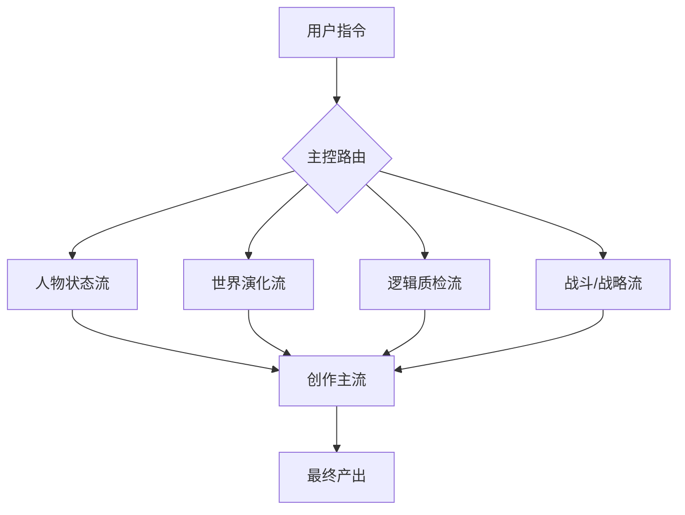

# 系统工作流定义 (System Workflow Definitions)

本文档定义了小说创作系统的**模块化工作流架构 (Modular Workflow Architecture)**。
本系统不再是单一的线性生成器，而是一个由多个**独立智能体 (Agents)** 协作组成的**世界模拟器**。

## 0. 架构总览 (Architecture Overview)

系统采用 **"4+1"** 结构：
*   **4个后台模拟流**: 负责生成世界的“底层数据”和“逻辑骨架”。
*   **1个前台创作流**: 负责将骨架包装为文学性的“叙事血肉”。

---

## 1. 人物状态流 (Character State Flow)
> **核心理念**: 人物拥有独立意志，不为剧情服务，只为自己而活。

*   **触发时机**: 每次章节生成前。
*   **输入**: 上一章结束时的人物状态、当前时间点。
*   **处理机制**: **静默推演 (Silent Simulation)**。
    *   对于不在场的关键 NPC（如凯恩、马木、艾薇），系统需根据其 `Char_*.md` 中的性格和当前局势，推演他们“现在正在做什么”。
    *   *Example*: 林野在下水道探险时，凯恩可能正在办公室签署一份关于下水道清洗的命令。
*   **输出**: `Character_State_Snapshot.json`
    *   包含：当前位置、正在进行的动作、心情状态、短期目标。

## 2. 世界演化流 (World Evolution Flow)
> **核心理念**: 世界是真实存在的，有其自身的运转逻辑和时间线。

*   **触发时机**: 章节跨度较大或进入新卷时。
*   **输入**: `World_Timeline.md`, `Factions_Matrix.md`。
*   **处理机制**: **里程碑事件钟 (Milestone Clock)**。
    *   **渐进式演化**: 在“现代”阶段，科技树按年迭代。
    *   **聚变式演化**: 当马木发布 T1+ 产品后，科技树按月/周迭代。
    *   **断裂式演化**: 外星入侵后，进入战时状态，按天/小时迭代。
*   **输出**: `World_Event_Log.md`
    *   包含：当前生效的社会新闻、科技突破、天气异常、派系动态。

## 3. 逻辑质检流 (Logic Quality Assurance Flow)
> **核心理念**: 绝对的理性与逻辑闭环。

*   **触发时机**: 细纲生成后 & 正文生成后。
*   **输入**: `Draft.md`, `World_Rules_*.md`, `Timeline_History.md`。
*   **处理机制**: **RAG 校验 (Retrieval-Augmented Validation)**。
    *   检索上下文，检查是否存在“死人复活”、“道具瞬移”、“性格OOC”等逻辑硬伤。
    *   *Feature*: 它不评价文笔，只评价**真实性**。
*   **输出**: `Logic_Report.md` (包含：Pass / Fail 及具体修改建议)。

## 4. 战斗与战略流 (Combat & Strategy Flow)
> **核心理念**: 基于数据的真实博弈。

*   **触发时机**: 涉及战斗或势力冲突时。
*   **分层处理**:
    *   **Level A (战术层)**: 个体战斗。
        *   输入：双方属性、环境标签、装备列表。
        *   输出：战斗过程推演（谁先手、谁受伤、胜负手是什么）。
    *   **Level B (战略层)**: 派系战争。
        *   输入：势力地图、资源点、兵力分布。
        *   输出：战线变动图（如：反抗军失去了第9区北部控制权）。
*   **输出**: `Combat_Simulation.md` (作为写作素材)。

---

## 5. 创作主流 (The Master Workflow)
> **核心理念**: 将数据转化为艺术。

*   **流程**:
    1.  **聚合 (Aggregation)**: 收集上述 4 个流的输出数据。
    2.  **大纲确认 (Outlining)**: 生成本章细纲。
    3.  **试写 (Trial Writing)**: 
        *   **内容**: 选取本章**最核心/最难写**的冲突片段（High-Stake Scene）。
        *   **目的**: 确认基调和人物语气。
    4.  **全篇生成 (Full Generation)**: 用户批准试写后，完成全章。
    5.  **同步 (Sync)**: 更新所有状态文档。

---

## 6. 实施指南 (Implementation Guide)

### 给 AI 的指令 (Prompt Template)

当用户要求“写下一章”时，请按以下步骤思考：

1.  **[Simulate]**: 跑一遍人物流和世界流。凯恩在干嘛？泰坦科技今天发布了什么？
2.  **[Strategize]**: 如果有战斗，先跑战斗流。谁赢？代价是什么？
3.  **[Outline]**: 写出细纲。
4.  **[Validate]**: 跑逻辑流。有没有吃书？
5.  **[Trial]**: 写一段高潮戏给用户看。
6.  **[Draft]**: 写正文。

### 文件夹结构映射
*   `03_Story_Planning/00_Workflows/` -> 存放本定义文档及各流的具体 Prompt。
*   `03_Story_Planning/05_Chapter_Staging/` -> 存放每章的中间产物（推演数据、逻辑报告）。
